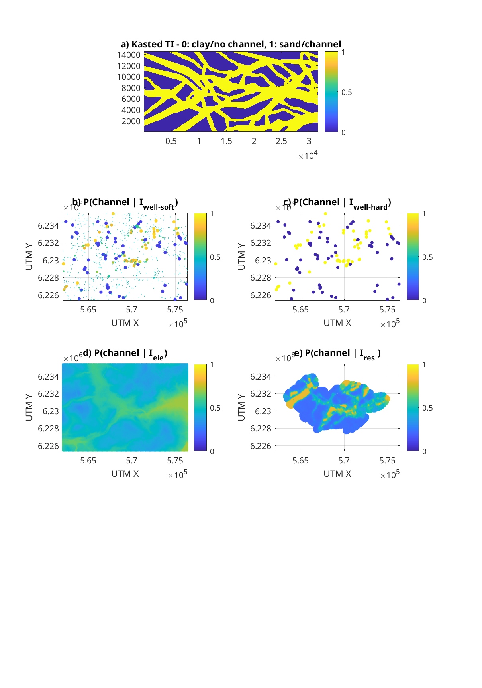

########### 
Kasted data
###########

These data have been produced by Despoina Exizidou, during her Master thesis ("Geostatistical modeling of buried valleys") at Technical University of Denmark, together with Anne Sophie Høyer (GEUS, Denmark), and Thomas Mejer Hansen.

Kasted is located North of Aarhus, Denmark, and drinking water is produced from high porosity buried valleys structures embedded in thicker non-permeable clays. Imaging of the subsurface buried valleys is therefore important to understand and manage the production of drinking water.

The subsurface is considered to consists of one of two lithologies, identified by '0' and '1':

0: Clay, outside/below buried valley

1: Sand, within a buried valley 

Training image
##############
`kasted_shrunk_ti.dat` (EAS matrix format) 632x291x5 pixel training image. Each pixel is of size 50x50 meter. Each of the 5 layers consists of a single 2D TI, with different shrinking applied.

The original TI has been resampled to allow using different pixel sizes

`kasted_ti_dx50.dat` (as the original TI)

`kasted_ti_dx100.dat` 316x145x20 resampled for dx=100;

`kasted_ti_dx200.dat` 158x72x80 resampled for dx=200;

`kasted_ti_dx300.dat` 105x48x180 resampled for dx=300;

`kasted_ti_dx400.dat` 79x36x320 resampled for dx=400;

Soft well-log data
#########

``kasted_soft_well.dat`` (EAS/GSLIB format) Probability of sand (column 4) and clay (column 5) estimated from welllog analysis at 1254 locations.

Hard well-log data
#########
``kasted_hard_well.dat`` (EAS/GSLIB format) 112 observations of clay or sand from welllog analysis. These data have been created from 'kasted_soft_well.dat', where the most certain observations of clay and sand, are considered hard data.  

Other data
##########

``kasted_soft_ele`` (EAS/GSLIB format). Elevation data for the area. A slight positive correlation between elevation and probability of channel is expected

``kasted_soft_res.dat`` (EAS/GSLIB format). Airborne SkyTEM data inverted to resistivity, and converted to probability of locating a buried valley.

M-files
####### 

``kasted_load.m`` loads all kasted data, at a specific resolution

``kasted_plot_obs.m`` loads Kasted data and plots the log data. 
Creates Figure 6 in Johannsson and Hansen (2021, in rev)

``kasted_mps_genesim_subset.m`` Tests estimation and simulation in a subset of data using GENESIM.  
Creates Figures 8-10 in Johannsson and Hansen (2021, in rev)

``kasted_mps_estimation.m`` Tests estimation and simulation in the whole Kasted area.  
Creates Figures 13-14 in Johannsson and Hansen (2021, in rev)

    Kasted data

